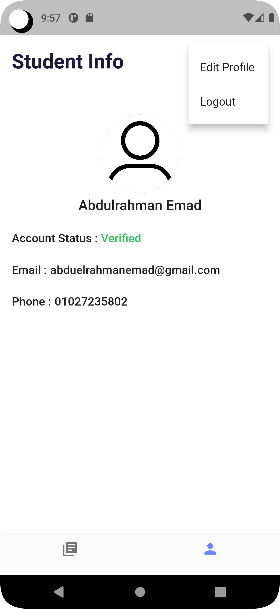

# Droos - Flutter Mobile Appliction 

It is a Mobile Application built with Flutter to help Instructors reach their students with the material needed for their course (Videos, PDFs, Exams)

## Table of contents 

- [Dashboard](#dashboard)
    - [Dashboard_Overview](#dashboardoverview)
    - [Dashboard_Screens](#dashboardscreens)
- [Droos](#droos)
    - [Droos_Overview](#droosoverview)
    - [Droos_Screens](#droosscreens)
- [Planning_to](#planningto)
- [Auther](#auther)
- [Contributes](#contributes)

## Dashboard

### Dashboard_Overview

This Dashboard is where admins can control Droos App by **Accepting** Pended accounts, **Verifiy** or **Unverifiy** the accounts and **Upload** Lectures' Material ( Video, PDF, Exam ).

### Dashboard_Screens

## Droos

### Droos_Overview

This App is where students can **Register** a new account and after getting approved by the admin through the dashboard they can **Login** into their accounts.
The verified accounts only can get the **material** of the lectures and **Edit** their profiles as they can **upload** a profile picture, **change** their passwords, emails, names, and phone numbers.

### Droos_Screens

## Planning_to

- Add push notifications feature.
- Add percentage indicator while uploading.

## Auther

- LinkedIn - [@abdulrahman-emad](https://www.linkedin.com/in/abdulrahman-emad-a73504234/)

## Contributes

- [Mohamed Waled](https://www.linkedin.com/in/mohamed-waled-82a51a1bb/) Helped me writing readme file.
- [Mohamed Abdallah](https://www.linkedin.com/in/mohamed-abdallah-a94158222/) Allowed me to use his private video from youtube